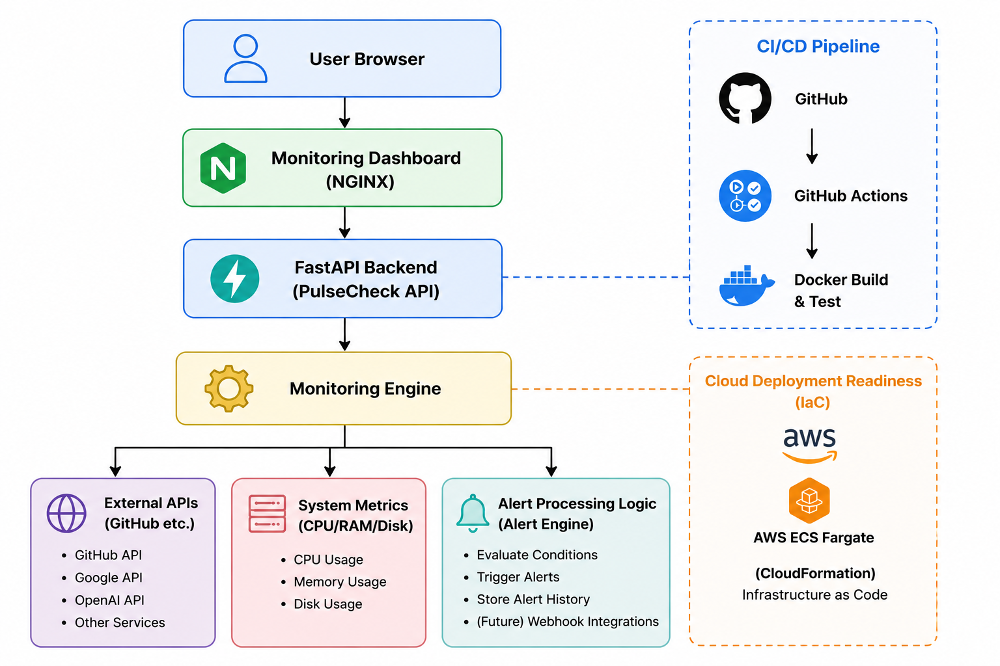

# PulseCheck — DevOps Observability Platform

PulseCheck is a lightweight DevOps-oriented observability and monitoring platform designed to monitor external services, collect infrastructure metrics, visualize operational health in real time, and automate deployment workflows using containerization and CI/CD practices.

---

# Features

## Real-Time Service Monitoring
- Monitors external APIs such as GitHub, Google, and OpenAI
- Measures response latency
- Performs health classification:
  - Healthy
  - Degraded
  - Critical

## Infrastructure Metrics
- CPU usage monitoring
- Memory usage monitoring
- Disk usage monitoring

## Historical Monitoring Engine
- Stores rolling monitoring snapshots
- Tracks latency trends over time
- Powers live dashboard graphing

## Alerting System
- Detects degraded-to-critical transitions
- Generates operational alerts
- Maintains alert history

## Structured Logging
- Persistent operational logs
- INFO and ERROR severity tracking
- Production-style monitoring logs

## Live Dashboard
- Real-time observability dashboard
- Live latency visualization
- Infrastructure metrics display
- Operational status cards

## Containerization
- Fully containerized using Docker
- Multi-container orchestration using Docker Compose

## CI/CD Automation
- GitHub Actions pipeline
- Automated testing
- Docker image build validation
- Deployment simulation
- Health endpoint verification

## Infrastructure-as-Code
- AWS CloudFormation template
- ECS Fargate deployment architecture

---

# Tech Stack

| Layer | Technology |
|---|---|
| Backend | FastAPI |
| Frontend | HTML, CSS, JavaScript |
| Charts | Chart.js |
| Monitoring | psutil, requests |
| Containerization | Docker |
| Orchestration | Docker Compose |
| CI/CD | GitHub Actions |
| IaC | AWS CloudFormation |
| Web Server | NGINX |

---

# Architecture Overview

```text
Dashboard UI
     ↓
FastAPI Monitoring API
     ↓
Health Check Engine
     ↓
External Services + System Metrics

